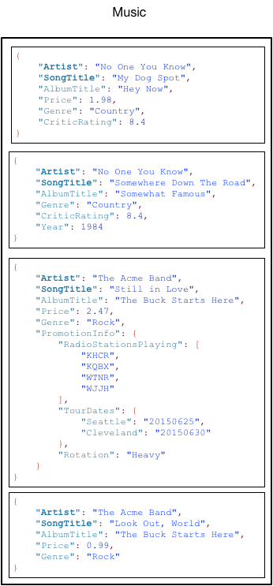
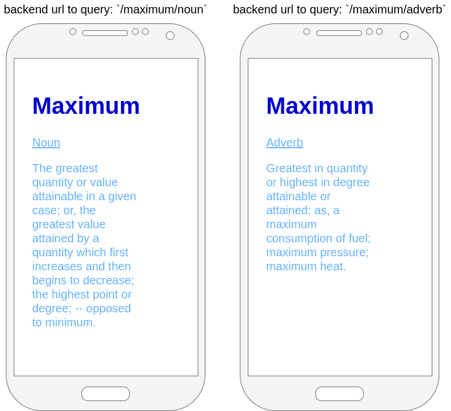

# What Is Amazon DynamoDB?
Amazon DynamoDB is a fully managed NoSQL database service that provides fast and predictable performance with seamless scalability.

## DynamoDB main features
Key-value and document data models \
Latency - Microsecond latency with DynamoDB Accelerator \
Global replication - Your globally distributed applications can access data locally in the selected regions to get single-digit millisecond read and write performance. \
On-demand mode - Instantly accommodates your workloads as they ramp up or down to any previously reached traffic level. \
Auto scaling - If your application traffic grows, DynamoDB increases throughput to accommodate the load. If your application traffic shrinks, DynamoDB scales down so that you pay less for unused capacity. \
On-demand backup and restore \
Point-in-time recovery \
Encryption at rest 

## Core Concepts
**Tables** - A table is a collection of data. \
**Items** - Each table contains zero or more items. \
**Attributes** - Each item is composed of one or more attributes.




## DynamoDB API
**Control Plane**
```
import { DynamoDBClient } from "@aws-sdk/client-dynamodb";
// Set the AWS Region.
const REGION = "REGION"; //e.g. "us-east-1"
// Create an Amazon DynamoDB service client object.
const ddbClient = new DynamoDBClient({ region: REGION });
export { ddbClient };
```

**CreateTable** – Creates a new table.
```
// Import required AWS SDK clients and commands for Node.js
import { CreateTableCommand } from "@aws-sdk/client-dynamodb";
import { ddbClient } from "./libs/ddbClient.js";

// Set the parameters
export const params = {
  AttributeDefinitions: [
    {
      AttributeName: "Season", //ATTRIBUTE_NAME_1
      AttributeType: "N", //ATTRIBUTE_TYPE
    },
    {
      AttributeName: "Episode", //ATTRIBUTE_NAME_2
      AttributeType: "N", //ATTRIBUTE_TYPE
    },
  ],
  KeySchema: [
    {
      AttributeName: "Season", //ATTRIBUTE_NAME_1
      KeyType: "HASH",
    },
    {
      AttributeName: "Episode", //ATTRIBUTE_NAME_2
      KeyType: "RANGE",
    },
  ],
  ProvisionedThroughput: {
    ReadCapacityUnits: 1,
    WriteCapacityUnits: 1,
  },
  TableName: "TEST_TABLE", //TABLE_NAME
  StreamSpecification: {
    StreamEnabled: false,
  },
};

export const run = async () => {
  try {
    const data = await ddbClient.send(new CreateTableCommand(params));
    console.log("Table Created", data);
    return data;
  } catch (err) {
    console.log("Error", err);
  }
};
run();
```

**DescribeTable**– Returns information about a table.
```
// Import required AWS SDK clients and commands for Node.js
import { DescribeTableCommand } from "@aws-sdk/client-dynamodb";
import { ddbClient } from "./libs/ddbClient.js";

// Set the parameters
export const params = { TableName: "TABLE_NAME" }; //TABLE_NAME

export const run = async () => {
  try {
    const data = await ddbClient.send(new DescribeTableCommand(params));
    console.log("Success", data);
    // console.log("Success", data.Table.KeySchema);
    return data;
  } catch (err) {
    console.log("Error", err);
  }
};
run();
```
**ListTables** – Returns the names of all of your tables in a list.
```
// Import required AWS SDK clients and commands for Node.js
import { ListTablesCommand } from "@aws-sdk/client-dynamodb";
import { ddbClient } from "./libs/ddbClient.js";

export const run = async () => {
  try {
    const data = await ddbClient.send(new ListTablesCommand({}));
    console.log(data);
    // console.log(data.TableNames.join("\n"));
    return data;
  } catch (err) {
    console.error(err);
  }
};
run();
```
**UpdateTable** – Modifies the settings of a table or its indexes. \
**DeleteTable** – Removes a table and all of its dependent objects from DynamoDB.
```
// Import required AWS SDK clients and commands for Node.js
import { DeleteTableCommand } from "@aws-sdk/client-dynamodb";
import { ddbClient } from "./libs/ddbClient.js";

// Set the parameters
export const params = {
  TableName: "CUSTOMER_LIST_NEW",
};

export const run = async () => {
  try {
    const data = await ddbClient.send(new DeleteTableCommand(params));
    console.log("Success, table deleted", data);
    return data;
  } catch (err) {
      console.log("Error", err);
    }
};
run();
```

**Data Plane** \
**PutItem** – Writes a single item to a table.

```
// Import required AWS SDK clients and commands for Node.js
import { PutItemCommand } from "@aws-sdk/client-dynamodb";
import { ddbClient } from "./libs/ddbClient.js";

// Set the parameters
export const params = {
  TableName: "TABLE_NAME",
  Item: {
    CUSTOMER_ID: { N: "001" },
    CUSTOMER_NAME: { S: "Richard Roe" },
  },
};

export const run = async () => {
  try {
    const data = await ddbClient.send(new PutItemCommand(params));
    console.log(data);
    return data;
  } catch (err) {
    console.error(err);
  }
};
run();
```

**BatchWriteItem** – Writes up to 25 items to a table.
```
// Import required AWS SDK clients and commands for Node.js
import { BatchWriteItemCommand } from "@aws-sdk/client-dynamodb";
import { ddbClient } from "./libs/ddbClient.js";

// Set the parameters
export const params = {
  RequestItems: {
    TABLE_NAME: [
      {
        PutRequest: {
          Item: {
            KEY: { N: "KEY_VALUE" },
            ATTRIBUTE_1: { S: "ATTRIBUTE_1_VALUE" },
            ATTRIBUTE_2: { N: "ATTRIBUTE_2_VALUE" },
          },
        },
      },
      {
        PutRequest: {
          Item: {
            KEY: { N: "KEY_VALUE" },
            ATTRIBUTE_1: { S: "ATTRIBUTE_1_VALUE" },
            ATTRIBUTE_2: { N: "ATTRIBUTE_2_VALUE" },
          },
        },
      },
    ],
  },
};

export const run = async () => {
  try {
    const data = await ddbClient.send(new BatchWriteItemCommand(params));
    console.log("Success, items inserted", data);
    return data;
  } catch (err) {
    console.log("Error", err);
  }
};
run();
```


**GetItem** – Retrieves a single item from a table.
```
// Import required AWS SDK clients and commands for Node.js
import { GetItemCommand } from "@aws-sdk/client-dynamodb";
import { ddbClient } from "./libs/ddbClient.js";

// Set the parameters
export const params = {
  TableName: "TABLE_NAME", //TABLE_NAME
  Key: {
    KEY_NAME: { N: "KEY_VALUE" },
  },
  ProjectionExpression: "ATTRIBUTE_NAME",
};

export const run = async () => {
  const data = await ddbClient.send(new GetItemCommand(params));
  return data;
  console.log("Success", data.Item);
};
run();
```

**BatchGetItem** – Retrieves up to 100 items from one or more tables.
```
// Import required AWS SDK clients and commands for Node.js
import { BatchGetItemCommand } from "@aws-sdk/client-dynamodb";
import { ddbClient } from "./libs/ddbClient.js";

// Set the parameters
export const params = {
  RequestItems: {
    TABLE_NAME: {
      Keys: [
        {
          KEY_NAME_1: { N: "KEY_VALUE" },
          KEY_NAME_2: { N: "KEY_VALUE" },
          KEY_NAME_3: { N: "KEY_VALUE" },
        },
      ],
      ProjectionExpression: "ATTRIBUTE_NAME",
    },
  },
};

export const run = async () => {
  try {
    const data = await ddbClient.send(new BatchGetItemCommand(params));
    console.log("Success, items retrieved", data);
    return data;
  } catch (err) {
    console.log("Error", err);
  }
};
run();
```

**DeleteItem** – Deletes a single item from a table.
```
// Import required AWS SDK clients and commands for Node.js
import { DeleteItemCommand } from "@aws-sdk/client-dynamodb";
import { ddbClient } from "./libs/ddbClient.js";

// Set the parameters
export const params = {
  TableName: "CUSTOMER_LIST_NEWEST",
  Key: {
    CUSTOMER_ID: { N: "1" },
  },
};

export const run = async () => {
  try {
    const data = await ddbClient.send(new DeleteItemCommand(params));
    console.log("Success, item deleted", data);
    return data;
  } catch (err) {
    console.log("Error", err);
    /*if (err && err.code === "ResourceNotFoundException") {
      console.log("Error: Table not found");
    } else if (err && err.code === "ResourceInUseException") {
      console.log("Error: Table in use");
    }*/
  }
};
run();
```

**Query** 
* Retrieves all items that have a specific partition key.
* You must specify the partition key value. 
* You can retrieve entire items, or just a subset of their attributes. 
* Optionally, you can apply a condition to the sort key values so that you only retrieve a subset of the data that has the same partition key. 
  * You can use this operation on a table, provided that the table has both a partition key and a sort key. 
  * You can also use this operation on an index, provided that the index has both a partition key and a sort key.
```
// Import required AWS SDK clients and commands for Node.js
import { QueryCommand } from "@aws-sdk/client-dynamodb";
import { ddbClient } from "./libs/ddbClient.js";

// Set the parameters
export const params = {
  KeyConditionExpression: "Season = :s and Episode > :e",
  FilterExpression: "contains (Subtitle, :topic)",
  ExpressionAttributeValues: {
    ":s": { N: "1" },
    ":e": { N: "2" },
    ":topic": { S: "SubTitle" },
  },
  ProjectionExpression: "Episode, Title, Subtitle",
  TableName: "EPISODES_TABLE",
};

export const run = async () => {
  try {
    const data = await ddbClient.send(new QueryCommand(params));
    return data;
    data.Items.forEach(function (element, index, array) {
      console.log(element.Title.S + " (" + element.Subtitle.S + ")");
    });
  } catch (err) {
    console.error(err);
  }
};
run();
```

**Scan**
* Retrieves all items in the specified table or index. 
* You can retrieve entire items, or just a subset of their attributes. 
* Optionally, you can apply a filtering condition to return only the values that you are interested in and discard the rest.
```

// Import required AWS SDK clients and commands for Node.js
import { ScanCommand } from "@aws-sdk/client-dynamodb";
import { ddbClient } from "./libs/ddbClient.js";

// Set the parameters.
export const params = {
  // Specify which items in the results are returned.
  FilterExpression: "Subtitle = :topic AND Season = :s AND Episode = :e",
  // Define the expression attribute value, which are substitutes for the values you want to compare.
  ExpressionAttributeValues: {
    ":topic": { S: "SubTitle2" },
    ":s": { N: "1" },
    ":e": { N: "2" },
  },
  // Set the projection expression, which the the attributes that you want.
  ProjectionExpression: "Season, Episode, Title, Subtitle",
  TableName: "EPISODES_TABLE",
};


export const run = async () => {
  try {
    const data = await ddbClient.send(new ScanCommand(params));
    return data;
    data.Items.forEach(function (element, index, array) {
      console.log(element.Title.S + " (" + element.Subtitle.S + ")");
    });
  } catch (err) {
    console.log("Error", err);
  }
}
run();
```

## Resources
[AWS: Setting Up DynamoDB](https://docs.aws.amazon.com/amazondynamodb/latest/developerguide/SettingUp.html) \
[AWS: DynamoDB SDK examples repo](https://github.com/awsdocs/aws-doc-sdk-examples/tree/main/javascriptv3/example_code/dynamodb/src) \
[AWS: Amazon DynamoDB: How It Works](https://docs.aws.amazon.com/amazondynamodb/latest/developerguide/HowItWorks.html) \
[AWS Training & Certification: Developing with Amazon DynamoDB Video Course](https://www.aws.training/Details/Curriculum?id=65583&redirect=false)

## Assignment

Your about to build an english dictionary app
1. Download [English Dictionary in CSV format](https://www.bragitoff.com/2016/03/english-dictionary-in-csv-format/)
2. Set up a DynamoDB with `dictionary` table
3. **DATABASE:** 
   1. Parse & Insert all words, in a common structure, to `dictionary` table
4. **BACKEND:** 
   1. build a REST API with the following end point(s):
      1. `GET /:word` - if word has more than one parts of speech will return all words part of speech, else, will return a word + definition + part of speech.
      2. `GET /:word/:partOfSpeech` - will return a word + definition + part of speech [(noun, verb, adjectives, etc...)](https://www.dictionary.com/e/parts-of-speech/)
      3. `GET /part-of-speech/:part` - for example, `/part-of-speech/adjective`, will return a random word + definition + part of speech (`part` is enum)
      4. `GET /part-of-speech/:part?letter=X` - for example, `/part-of-speech/noun?letter=m`, will return a random word with the same letter + definition + part of speech
   2. **BONUS**: should be deployed as `lambda function`
5. **FRONTEND:**
   1. build a `create-react-app` english dictionary app (mobile first)
   2. URL routes:
      1. `/:word` - dynamic route - `word` is dynamic URL parameter, used to request backend api
      1. `/:word/:partOfSpeech` - dynamic route - `word` is dynamic URL parameter, used to request backend api
      2. `/part-of-speech/:part` - `part` is enum URL parameter, used to request backend api
   3. each word in dictionary is clickable and will redirect to a common URL 
   4. **BONUS** should be deployed to `S3 bucket`
6. You should provide:
   1. frontend github repo, in readme:
      1. s3 url(s) + screenshots for each scenario
   2. backend github repo. in readme:
      1. lambda function url(s) + description for each scenario



